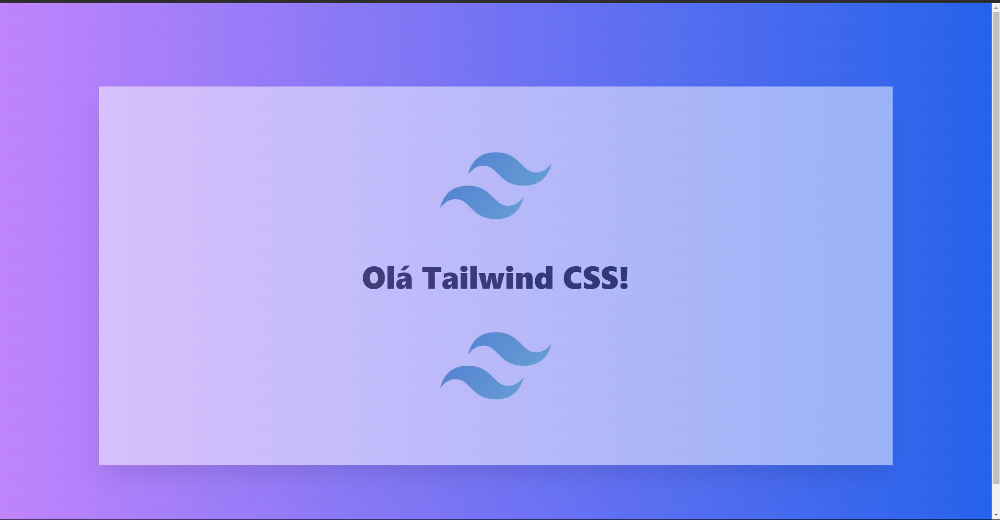

# Treinamento com Tailwind CSS

Este repositório contém um projeto focado no **treinamento com Tailwind CSS**, desenvolvido como parte do aprendizado em design de interfaces modernas e responsivas. O objetivo principal foi explorar a criação de layouts rápidos e eficientes utilizando classes utilitárias do Tailwind.

---

## Tecnologias Utilizadas

- **HTML5**
- **Tailwind CSS**

---

## Objetivo do Projeto

- Aprender e aplicar conceitos de **utility-first** com Tailwind CSS.
- Criar interfaces responsivas de forma prática e eficiente.
- Explorar o uso de configurações e personalizações no Tailwind CSS.

---

## Pré-visualização

  

---

📚 *Projeto desenvolvido para prática e aperfeiçoamento em Tailwind CSS.*
